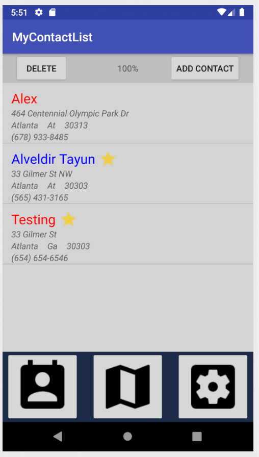
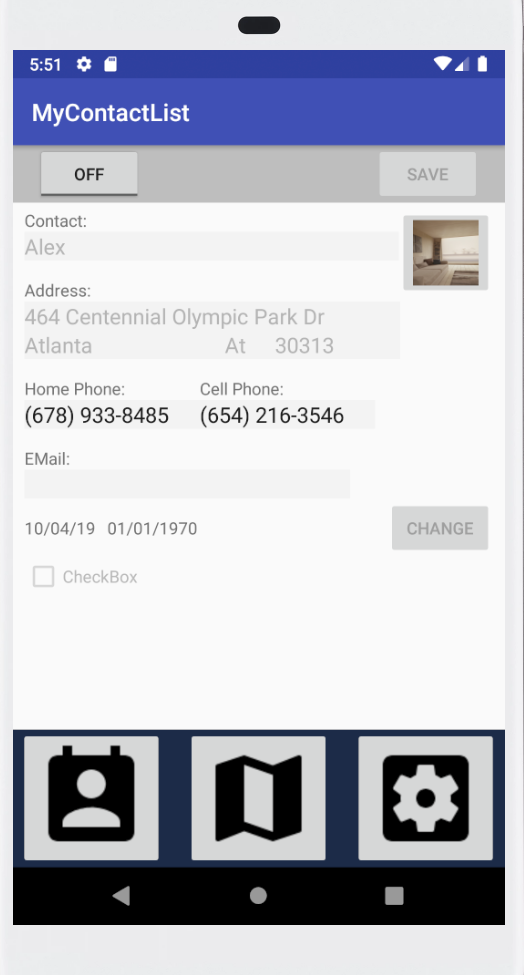
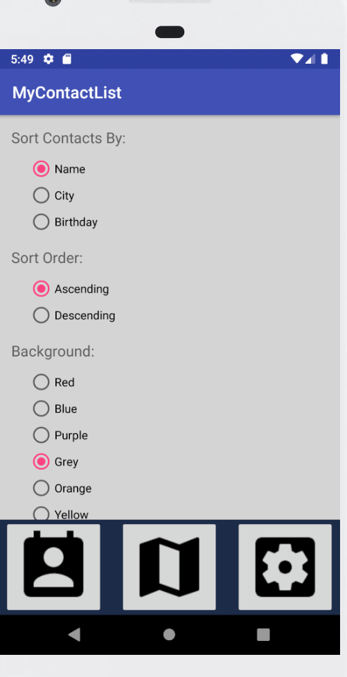
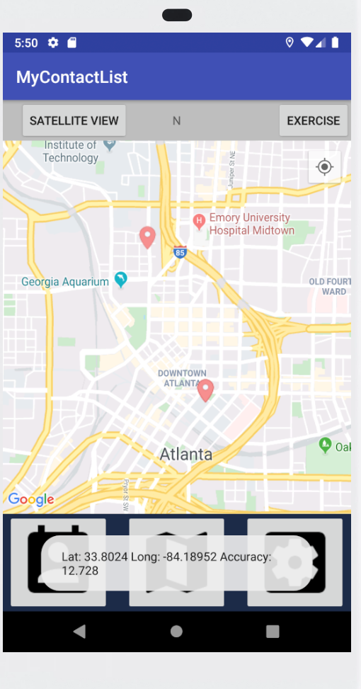

# MyContactList
Mobile Development at Georgia State University

## Textbook
Mobile App Development for iOS and Android 2nd Edition

## Contact List
Should show all contacts in the database  
 

## Edit Contacts
User should also be able to edit contact(name, address picture ect) and save to database  

## Settings Page
Allow user to define how they want the contact list sorted and what background color they want for the application using SharedPreferences 

## Contact Location
Using Google's map API, find the location of youor contacts using the address in the database. Also be able to find location via bluetooth  

